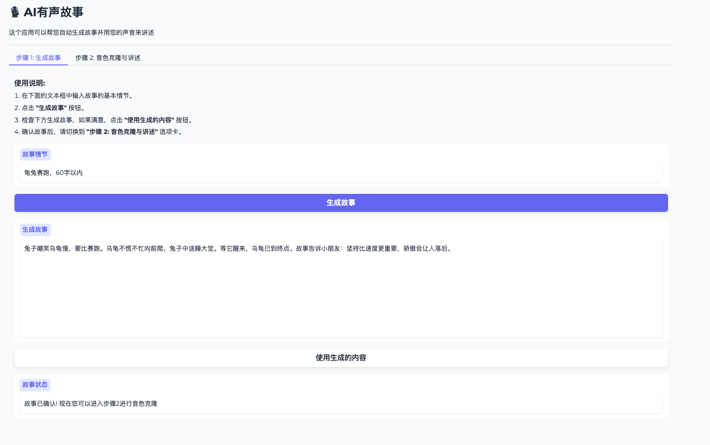
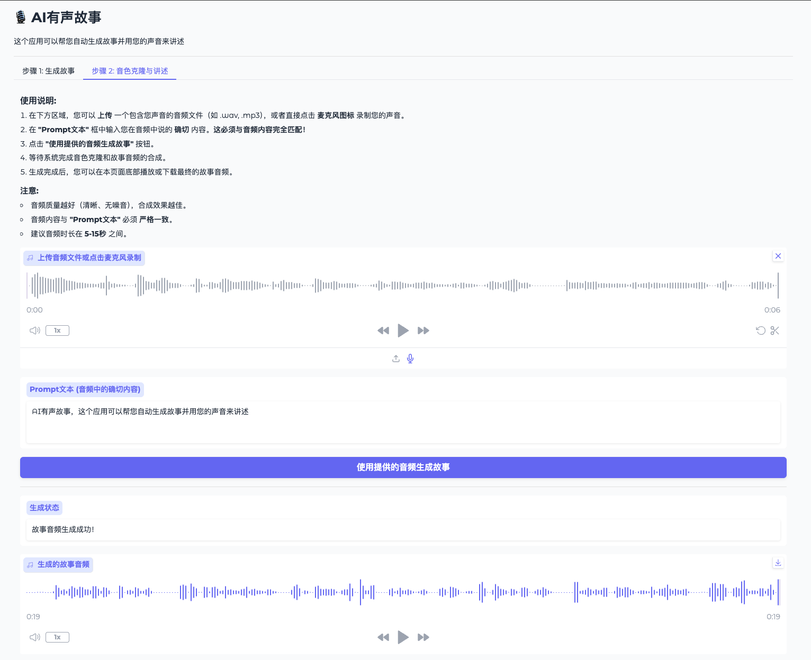

# AI有声故事

一个结合AI生成故事和语音克隆技术的应用，让您可以用自己的声音讲述AI生成的故事。


## 功能特点

- 基于大语言模型生成有趣的儿童故事
- 使用CosyVoice 2技术实现零样本语音克隆
- 友好的Gradio交互界面
- 支持长文本分段合成

## 安装指南

### 1. 克隆本仓库

```bash
git clone https://github.com/klay-liu/AI-Voice-Story.git
cd AI-Voice-Story
```

### 2. 下载CosyVoice依赖库

```bash
# 克隆CosyVoice及其子模块
git clone --recursive https://github.com/FunAudioLLM/CosyVoice.git

# 如果子模块克隆失败，可以手动更新
cd CosyVoice
git submodule update --init --recursive
cd ..
```

### 3. 下载CosyVoice2模型

```bash
# 确保已在CosyVoice目录中创建pretrained_models目录
mkdir -p CosyVoice/pretrained_models

# 下载模型
git clone https://www.modelscope.cn/iic/CosyVoice2-0.5B.git CosyVoice/pretrained_models/CosyVoice2-0.5B
```

### 4. 安装依赖

```bash
# 安装应用依赖
pip install -r requirements.txt

# 安装CosyVoice的依赖
pip install -r CosyVoice/requirements.txt
```

### 5. 配置环境变量

复制示例环境变量文件并编辑:

```bash
cp .env.example .env
# 编辑.env文件，填入您的API密钥
```

### 6. 准备资源文件

```bash
# 创建资源目录
mkdir -p assets
# 确保将故事图片放在assets目录下
# 命名为reading-story-at-home-together.jpg
```

## 使用方法

运行应用:

```bash
python app.py
```

然后在浏览器中访问显示的URL（通常是http://127.0.0.1:7860 ）。

### 步骤1：生成故事

1. 输入故事的基本情节
2. 点击"生成故事"按钮
3. 检查生成的故事内容
4. 点击"使用生成的内容"确认故事

### 步骤2：音色克隆与讲述

1. 上传一段包含您声音的音频文件，或使用麦克风录制
2. 输入音频中说的确切内容（必须完全匹配）
3. 点击"使用提供的音频生成故事"按钮
4. 等待系统合成完成，然后播放或下载生成的故事音频

## 注意事项

- 音频质量越好（清晰、无噪音），合成效果越佳
- 音频内容与文本必须严格一致
- 建议参考音频时长在5-15秒之间
```
